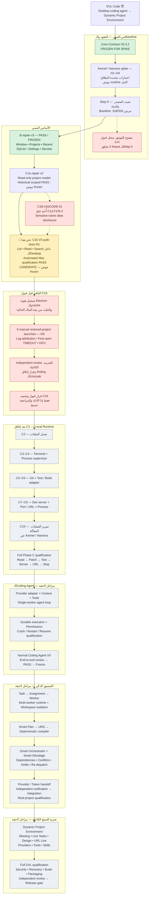

# bluid dvl etape by etape

Date: 2026-10-25 — Europe/Paris.
État vérifié de référence: checkpoint du 2026-10-20.
Ce graphique ne déclare aucune nouvelle acceptation ni aucun nouveau freeze.

```mermaid
flowchart TD
    GOAL["DVL Code 😈
Desktop coding agent → Dynamic Project Environment"]

    subgraph FOUNDATION["من الصفر — العقود والـBaseline"]
        CORE["Core Contract V0.3.2
FROZEN FOR SPIKE"]
        SPIKE["Kernel / Harness spike — H1–H4
اختبارات محددة النطاق؛ موش runtime كامل"]
        ZERO["Step 0 — تثبيت المصدر والبيئة
Baseline: 318/318 مرتين"]
        GAP["مفتوح للتوثيق: سجل قبول 0.H
لا نختلق freeze للـStep 0"]
        CORE --> SPIKE --> ZERO
        ZERO -.-> GAP
    end

    subgraph DESKTOP["الأساس المبني"]
        B["B repair v3 — PASS / FROZEN
Window • Projects • Recent
SQLite • Settings • Secrets"]
        C1A["C1a repair v2
Read-only project reader
Historical scoped PASS؛ موش frozen"]
        FINDING["C1B-UNICODE-01
أُعيد فتح C1a F1/N-2
Sensitive-name alias disclosure"]
        R1["📍 نحن هنا: C1b V3 auth-tests R1
List • Read • Search داخل الـDesktop
Automated Mac qualification PASS
CANDIDATE — موش frozen"]
        B --> C1A --> R1
        C1A -.-> FINDING
        FINDING -.-> R1
    end

    subgraph CLOSE["الباقي قبل قبول C1b"]
        ID["تسجيل هوية Electron والـcache
والتثبّت من بيئة الماك الحالية"]
        RUNS["5 manual restored-project launches — 0/5
Log attribution • First-open TIMEOUT • GPU"]
        REVIEW["Independent review للحزمة الكاملة
وقرار إغلاق finding الـUnicode"]
        FREEZE["قرار قبول وتجميد C1b
فقط إذا الأدلة والمراجعة تسمح"]
        ID --> RUNS --> REVIEW --> FREEZE
    end

    subgraph RUNTIME["بعد إغلاق C1 — Local Runtime"]
        EDIT["C2 — تعديل الملفات"]
        TERM["C3–C4 — Terminal + Process supervisor"]
        TOOLS["C5–C6 — Git + Test / Build adapter"]
        LIVE["C7–C9 — Dev server + Port / URL + Preview"]
        ENFORCE["C10 — تمرير العمليات المعدِّلة
عبر Kernel / Harness"]
        CGATE["Full Phase C qualification
Read → Patch → Test → Server → URL → Stop"]
        EDIT --> TERM --> TOOLS --> LIVE --> ENFORCE --> CGATE
    end

    subgraph AGENT["الـCoding Agent — مراحل لاحقة"]
        LOOP["Provider adapter + Context + Tools
Single-worker agent loop"]
        RECOVERY["Durable execution + Permissions
Crash / Restart / Resume qualification"]
        SINGLE["Normal Coding Agent V0
End-to-end review → PASS → Freeze"]
        LOOP --> RECOVERY --> SINGLE
    end

    subgraph SMART["التنسيق الذكي — مراحل لاحقة"]
        WORKERS["Task → Assignment → Worker
Multi-worker runtime + Workspace isolation"]
        PLAN["Smart Plan → URG → Deterministic compiler"]
        ORCH["Smart Orchestrator + Smart Décalage
Dependencies • Conflicts • Holds • Re-dispatch"]
        VERIFY["Provider / Token handoff
Independent verification → Integration
Real-project qualification"]
        WORKERS --> PLAN --> ORCH --> VERIFY
    end

    subgraph PRODUCT["تجربة المنتج الكاملة — مراحل لاحقة"]
        ENV["Dynamic Project Environment
Meeting • Live Tasks • Design • URL Live
Providers • Tools • Skills"]
        RELEASE["Full DVL qualification
Security • Recovery • Scale • Packaging
Independent review → Release gate"]
        ENV --> RELEASE
    end

    GOAL --> CORE
    ZERO --> B
    R1 --> ID
    FREEZE --> EDIT
    CGATE --> LOOP
    SINGLE --> WORKERS
    VERIFY --> ENV

    classDef frozen fill:#d9f2df,stroke:#278442,color:#123d20
    classDef current fill:#fff0bd,stroke:#b58100,color:#503900
    classDef open fill:#ffe0df,stroke:#bd4540,color:#642522
    classDef future fill:#edf0f5,stroke:#7b8596,color:#293344

    class CORE,B frozen
    class R1 current
    class GAP,FINDING,ID,RUNS,REVIEW,FREEZE open
    class EDIT,TERM,TOOLS,LIVE,ENFORCE,CGATE,LOOP,RECOVERY,SINGLE,WORKERS,PLAN,ORCH,VERIFY,ENV,RELEASE future
```

